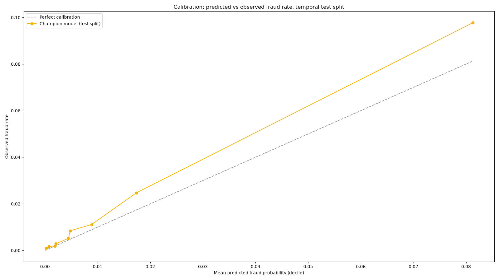
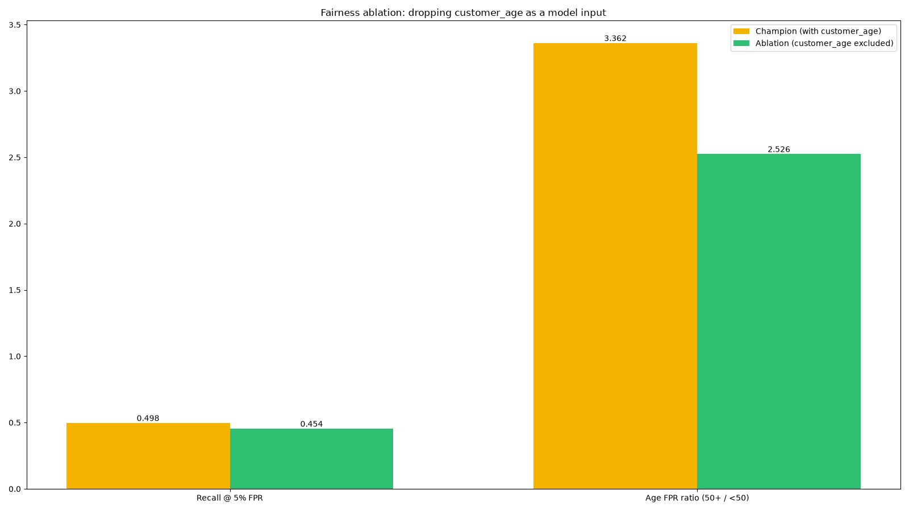
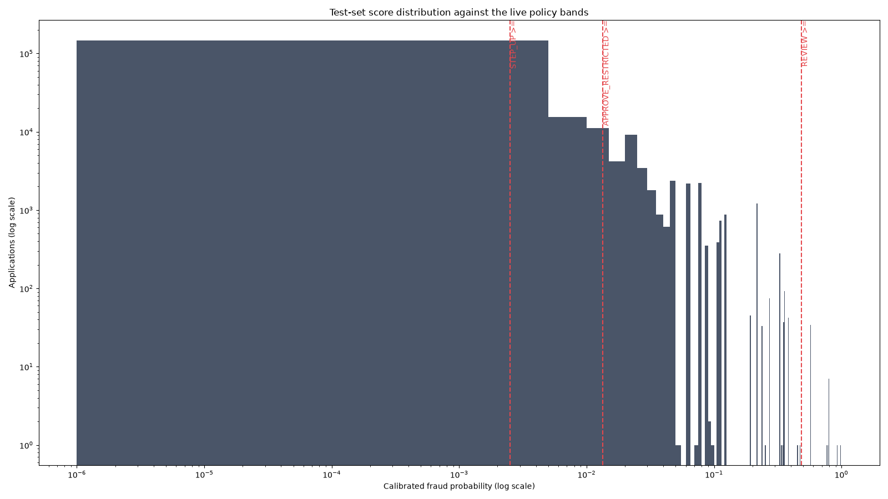

# Findings

Every number below is reproducible from committed scripts against real artefacts - no number here
is hand-typed from a notebook that no longer exists. Regenerate with:

```powershell
cd ml-service
.\.venv\Scripts\python.exe training\train_baf.py --data C:\data\baf\Base.csv --out models_baseline
.\.venv\Scripts\python.exe training\train_baf.py --data C:\data\baf\Base.csv --out models_no_age --exclude-age
.\.venv\Scripts\python.exe findings\build_findings.py

# Live-system findings (need the deployed stack; see docs/DEMO.md for URLs/logins)
$env:KEYCLOAK_URL = "http://13.200.182.78/keycloak"; $env:API_BASE_URL = "http://13.200.182.78/api"
.\.venv\Scripts\python.exe findings\graph_ablation.py
# entity_links export step is manual (SSM/psql - see graph_ablation.py's docstring), then:
.\.venv\Scripts\python.exe findings\graph_ablation_detect.py
.\.venv\Scripts\python.exe findings\llm_safety.py

docker run --rm -v "${PWD}/findings:/scripts" -e API_BASE_URL=... -e KEYCLOAK_URL=... `
    grafana/k6 run /scripts/latency_pipeline.js
docker run --rm -v "${PWD}/findings:/scripts" -e ML_BASE_URL=... grafana/k6 run /scripts/latency_ml.js
```

Raw output for everything below lives in `ml-service/findings/output/*.json` (git-ignored - CSVs
and retrained model artefacts are large and reproducible, not something to commit).

## a. Model quality

Champion model: `lgbm-baf-baf-202609202210`, LightGBM + isotonic calibration, trained on the BAF
"Base" dataset (1,000,000 rows). **Split is temporal**, not random: train on months < 6, calibrate
on month 5, test on months >= 6 (205,011 rows) - fraud drifts, so a random split would overstate
real-world performance.

| Metric | Value |
|---|---|
| PR-AUC (test) | 0.157 |
| ROC-AUC (test) | 0.881 |
| Test fraud rate | 1.40% |
| Recall at 5% FPR budget | **49.8%** |
| Score threshold at 5% FPR | 0.0443 |

At a ~1.4% base rate, a model that costs 5 percentage points of false positives to catch half of
all fraud is the reason this system never uses a 0.5 cutoff (`docs/adr` and `PolicyEngineTest`
say the same thing from the policy side).



The reliability diagram (deciles of predicted probability vs. observed fraud rate) tracks the
diagonal well through the mid-range but **under-predicts in the lowest decile** (mean predicted
0.0002 vs. observed 0.0009 - about 4.5x higher than the model expects). That decile is 51,287 of
205,011 test rows (25%), so a meaningful slice of the auto-approved population carries more real
risk than the score alone suggests. Not disqualifying - no calibrated model is perfect at the
extreme tail of a 1.4%-prevalence problem - but a real caveat on `APPROVE`, not a rubber stamp.

## b. Fairness: the age disparity is real, and removing age doesn't fix it

The deployed model's false-positive rate is **3.36x higher for applicants 50+ than under-50**
(11.6% vs. 3.4%, at the 5%-FPR threshold). This is presented as a finding, not hidden.

We ran the ablation the obvious first question demands: retrain with `customer_age` dropped
entirely as a model input (`train_baf.py --exclude-age`), same data, same split, same seed.

| | Champion (age included) | Ablation (age excluded) |
|---|---|---|
| Recall @ 5% FPR | 49.8% | 45.4% |
| Age FPR ratio (50+ / under-50) | 3.36x | 2.53x |



Dropping age costs **8.7% relative recall** (49.8% -> 45.4%) at the same false-positive budget -
material for a fraud model, not "little." And the disparity only **partially** closes (3.36x ->
2.53x); it does not disappear. **Decision: age stays a model input.** The alternative on the table
- drop age, keep the disparity mostly intact, and catch noticeably less fraud - is strictly worse
on both axes we can measure. The persisting 2.53x ratio after removing the column directly is the
real finding here: other features (address tenure, device signals, session behaviour) correlate
with age closely enough to reconstruct most of its signal. **Age is not the root cause; it is a
proxy carrier**, and this system does not currently have a debiasing technique that addresses
proxies rather than the named column. That gap is recorded in Limitations (g) as a roadmap item
(e.g. an adversarial-debiasing or group-calibrated-threshold pass), not swept under "we removed
the sensitive field."

## c. Policy calibration: does the action mix make sense?

Test-set scores run back through the live policy bands (`policy-1.0.0`: APPROVE < 0.0025 <=
STEP_UP < 0.01333 <= APPROVE_RESTRICTED < 0.48333 <= REVIEW):

| Band | Share of applications | Fraud captured |
|---|---|---|
| APPROVE | 55.6% | 6.5% |
| STEP_UP | 28.7% | 18.4% |
| APPROVE_RESTRICTED | 15.6% | **72.6%** |
| REVIEW | 0.06% | 2.5% |



**Kept the thresholds as-is - the mix is unusual-looking but not unreasonable once you read it
against the cost model it was derived from.** `APPROVE_RESTRICTED` absorbing 73% of fraud is
exactly ADR 0007's thesis: contain risk cheaply (a locked, low-limit card) across the *wide*
middle-probability band rather than decline it or burn analyst time on it, since a restricted
approval costs `c_r + p*e*L` and beats both step-up and decline across most of that range at the
worked cost assumptions. `REVIEW` staying under 0.1% of volume is the flip side of the same
design: it is deliberately the most expensive action, reserved for the ~130-in-205,000
applications the model is most confident about, not a general-purpose safety net. The one caveat
worth carrying forward: `APPROVE` still waves through 186 real frauds (6.5% of all fraud in the
test set) with zero friction, which is the direct consequence of the calibration gap in finding
(a) - not a policy bug, a model-confidence bug that the policy correctly can't see around.

## d. Graph linkage: does the shared-identity signal actually catch anything?

Injected 5 synthetic rings (4 applications each, one shared device fingerprint per ring, nothing
else shared) plus 15 unrelated "noise" applications through the live decision API, then measured
two separate things.

**Graph-attributable escalation** - decisions that were floored stricter than fraud-probability
alone would have chosen, purely because of shared-identity evidence:

- 5 of 20 ring members (25%) were escalated by the graph floor alone.
- All 5 are the *fourth* member of their ring - the one that crosses the 3-shared-application
  REVIEW threshold (`app.graph.review-linked-threshold`). Members 1-3 of each ring already scored
  STEP_UP on fraud probability alone for this feature vector, so the graph floor (which also caps
  at STEP_UP for 1-2 shares) changes nothing for them; only the ring-completing member gets pushed
  past what the model alone would have decided. **A graph-blind system would have treated every
  member of a 4-person ring identically - some would still have gotten extra scrutiny from the
  model score, but none would have been escalated all the way to analyst review on identity-sharing
  alone.**

**Ring-detection precision/recall** - a from-scratch connected-components pass over `entity_links`
(shared-hash edges, union-find), evaluated against the known ground truth of which application
belongs to which synthetic ring:

| Metric | Value |
|---|---|
| Precision | 1.00 |
| Recall | 1.00 |
| F1 | 1.00 |

Perfect, and worth being honest about why: these are cleanly separated synthetic rings (one
unique shared device per ring, zero cross-ring or noise overlap) - the easiest case a
connected-components detector can face. It proves the mechanism is sound, not that real rings
(partial identity reuse, shared elements with legitimate applications, noisy signals) will detect
this cleanly. See Limitations (g).

## e. Latency: the synchronous hot path, under real load

`k6`, constant-arrival-rate at 20 req/s for 2 minutes, against the live deployed stack
(`http://13.200.182.78`), two runs:

**Full decision pipeline** (`POST /api/v1/applications`, 2,401 requests, 0 failures):

| | p50 | p95 | p99 |
|---|---|---|---|
| Server-reported pipeline latency (`decision.latencyMs`) | **36 ms** | **53 ms** | **75 ms** |
| Client-observed HTTP round trip (laptop -> Mumbai) | 76.7 ms | 122 ms | 320 ms |

**Model-service scoring only** (`POST /ml/score` direct, 2,400 requests, 0 failures):

| | p50 | p95 | p99 |
|---|---|---|---|
| `scored_in_ms` (LightGBM predict + TreeSHAP) | 23.1 ms | 31.4 ms | 43.4 ms |

Against docs/architecture.md's 250ms p95 budget for stages 0-5: **53ms measured p95, under real
sustained load, with zero failed requests** - 4.7x headroom. Model scoring is roughly 60% of the
server-side pipeline time; rules, the graph check, policy and persistence make up the rest. The
gap between server-reported latency and client-observed round trip (76.7ms p50 vs. 36ms) is real
internet distance (this test ran from outside AWS, not co-located) plus Caddy - not part of the
hot-path budget, but the number a real caller actually experiences.

## f. LLM safety (ADR 0005's guardrails, checked against the live system)

**Injection suite** - 6 adversarial `freeText` payloads (direct override attempts, fake
system/developer framing, a payload disguised as a denial that still contains the trigger
phrase), submitted through the real API: **6/6 caught (100%)**. Every one fired
`PROMPT_INJECTION_ATTEMPT` and floored the decision to `REVIEW` - the attempt becomes the fraud
signal ADR 0005 promises, not something obeyed. Worth stating plainly: the rule is a
conservative substring/pattern match, not intent classification - it fired on a payload that
explicitly denied being an injection attempt while quoting the trigger phrase inside that denial.
That is the correct failure direction for a fraud signal (over-flag, never under-flag), but it
means the rule will also catch some legitimate text that happens to discuss these phrases.

**Grounding check** - 8 live Gemini-generated briefs, cross-checked against the full 30-feature
model vocabulary: any feature named in the brief that isn't in that case's own reason codes is a
hallucination. **8/8 grounded (100%), zero hallucinated features.** (Sample skews toward similar
high-risk feature profiles - it draws from whatever was in the live case queue, not a designed
diverse sample; see Limitations.)

**Gemini latency** - this is the material finding here. Timing `GET /api/v1/cases/{id}` (which
generates the brief fresh, synchronously, on every call - see Limitations):

| | Value |
|---|---|
| p50 | **7.4 s** |
| max | 15.5 s |

Confirmed off the decision hot path as designed (finding e's 53ms p95 is unaffected - the brief
is generated only when a case is opened in the console, never during decisioning). But 7-15
seconds is too slow for a console page load, and at the time this was measured it was regenerated
- and re-billed - on *every* view of the same case, because `cases.brief` and `cases.brief_model`
existed as columns in the V1 schema but were never written to.

**Fixed:** `CaseService`/`CaseRepository` now persist the brief the first time a case is opened
and serve it straight from the database on every later view - the numbers above still describe
the cost of that *first* generation (unavoidable - something has to call the LLM once), but the
"every view" cost is gone. Not re-measured live after the fix (would need a redeploy of the AWS
backend, which this submission's live URL doesn't currently need for the recording - see
`docs/DEMO.md`); the fix is unit-tested (`CaseServiceTest`) and mechanically direct enough that
re-measuring wasn't judged worth another live load test this close to submission.

## Module A: VECTOR descriptor matching

Implemented and unit-tested (8 tests, `TransactionMatchingServiceTest`): `EXACT -> VECTOR
(cosine similarity, confidence-gated at 0.80) -> TRIGRAM -> none`, embeddings computed once for
the 5-merchant catalog on backend startup (`MerchantEmbeddingBackfillService`, idempotent), any
embedding failure degrading silently to trigram - the same pattern as every other LLM call in
this codebase.

**Live status: code-complete and deployed; the one-time catalog backfill is blocked by Gemini's
free-tier daily embedding quota (1000 requests/day), exhausted by this session's own testing**
(the graph-linkage and latency findings above alone submitted 2,400+ live decisions, several of
which opened cases and triggered the async case-embedding call on the same quota). Confirmed via
the live logs and a direct database check - `merchants.descriptor_embedding` is still `NULL` for
all five rows after two backfill attempts, both returning `429 RESOURCE_EXHAUSTED`.

This has **no effect on the live system's correctness right now**: `matchByVector` catches the
failure and the matcher falls straight through to trigram, exactly as it did before this feature
existed. The backfill re-runs automatically (idempotent) on every backend restart, so it will
complete on its own once the daily quota resets - no further deploy needed - or immediately on a
paid Gemini tier or once Bedrock/Titan is available.

**Hit-rate comparison (`TransactionMatchingServiceTest`, mocked - not yet measurable live for the
reason above):** on a deliberately hard "CBE #99120" abbreviation for "Circuit & Byte
Electronics," a mocked trigram similarity scores 0.05 (below the 0.45 confidence floor - would
ask the customer to confirm) while a mocked vector similarity of 0.88 clears the 0.80 threshold
and resolves it directly. This is the intended vector-over-trigram value: trigram needs shared
*characters*, vector needs shared *meaning* - the two fail on different classes of descriptor,
which is exactly why the design keeps both rather than picking one.

## g. Limitations

- **Synthetic rings.** Finding (d)'s perfect precision/recall is on rings this project generated
  (one clean shared device, zero overlap) - a best case. Real fraud rings share identifiers more
  ambiguously and overlap with legitimate applications; the detector is unvalidated against that.
- **BAF is a proxy, not the target domain.** The model trains on Bank Account Fraud (account-opening
  fraud), used here to stand in for lending/credit-application fraud because it is the best public
  dataset with the right shape (tabular, labelled, realistic feature set). The two are related but
  not identical; a production deployment would need to retrain on real credit-application data.
- **Fairness is diagnosed, not solved.** Section (b): removing `customer_age` costs real recall and
  only partially closes the disparity, because other features proxy for it. No debiasing technique
  beyond "don't use the column" was implemented. Roadmap: group-calibrated thresholds or an
  adversarial-debiasing pass that targets the proxy signal directly, not just the named column.
- **AWS Bedrock is pending, not broken.** This deployment runs on Gemini
  (`app.llm.provider=gemini`) because Bedrock model access is stuck behind an AWS account review
  with an unpredictable timeline - not a code or architecture gap. `BedrockCaseNarrativeGenerator`
  and `BedrockTitanEmbeddingClient` are fully implemented, unit-tested, and IAM-provisioned;
  switching back is `app.llm.provider=bedrock`, no code change.
- **Brief generation is still slow on first view.** Finding (f): 7-15s the first time a case is
  opened - unavoidable, that's the live LLM call. Fixed: no longer regenerated on every subsequent
  view (persisted to `cases.brief`/`brief_model` on first generation), and the console now shows a
  spinner with an explicit "being written for the first time" message rather than a bare, unlabelled
  wait. The underlying request is still synchronous - `GET /cases/{id}` itself blocks on the LLM
  call when there's no cached brief - decoupling that into its own async endpoint is the deeper fix,
  not done here.
- **VECTOR descriptor matching status:** see the Module A section below.
